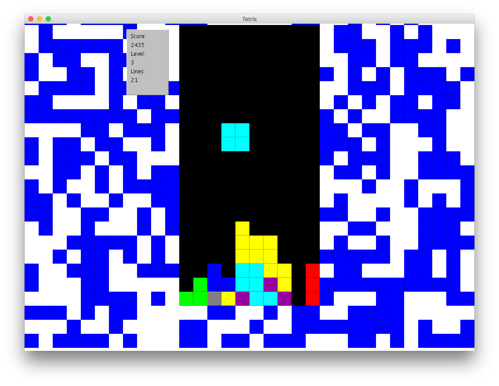

# Tetris

A classic Tetris game that includes 2-player mode, some unique pieces that break all the rules of Tetris, and two fun skins.

## General Gameplay
In Tetris, you try to fit pieces together at the bottom of the screen so that you fill every space all the way across a row. Once a row is filled, it vanishes and you gain points.

### 2-Player Mode
When one player clears two or more lines, a penalty row of randomly placed squares is added to the bottom of the oponent's grid.

## Controls
**Player 1**
* Up-Arrow: Rotate the piece
* Down-Arrow: Drop the piece
* Left/Right Arrows: Move the piece left/right

**Player2**
* W: Rotate the piece
* S: Drop the piece
* A: Move the piece left
* D: Move the piece right
